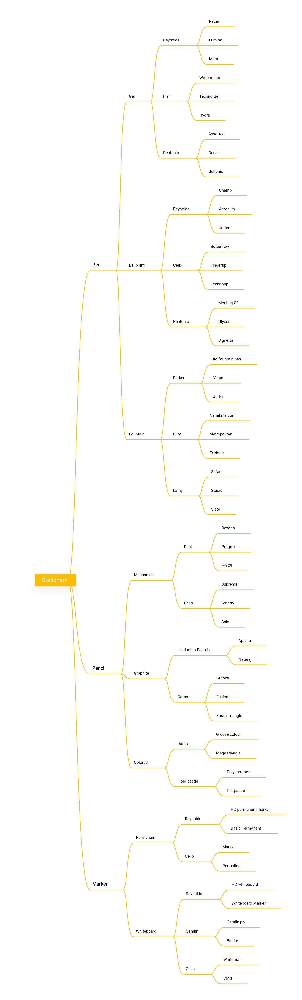

# Virtual Stationary Shop(Qspiders)

## Index

1. [Summery](#summery)
2. [TreeDiagram](#treediagram)
3. [output](#output)

# Summery

- The purpose of this project is to make a java based application which includes different OOPS concepts such as **inheritance, encapsulation, polymorphism and abstraction** etc.

- I have used java concept like **static** and **non-static members ,interface ,getter-setter method and scanner class** 

- I have used **Scanner** class to take input from user and **switch case** to display output 
*********************************

# TreeDiagram

**************************

# Output
.png)

***************************

